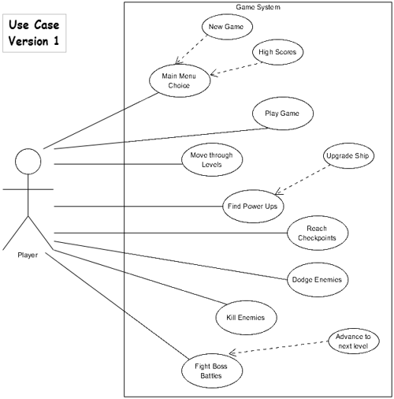
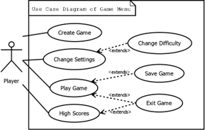
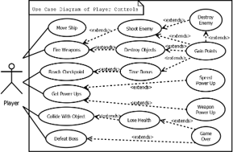
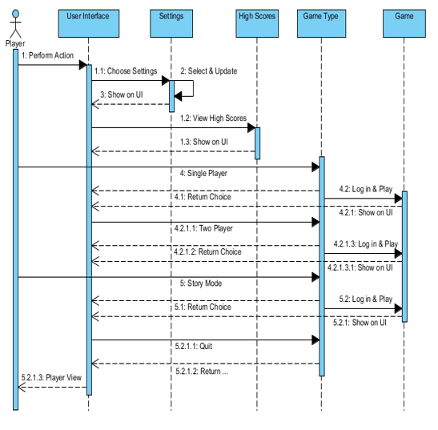
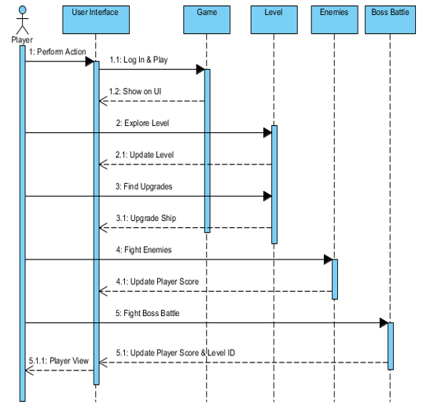

# Example of Use

    Use Case Diagram

The game supports a race against time where players navigate through levels, gather power-ups, reach checkpoints, and fight enemies or boss battles. Controls are managed via keyboard or game controller. Players can also navigate an interactive menu system to select game states, configure settings, and view high scores.

## Use Case Scenarios

* **Single Player & Story Mode**: Players progress through levels with narrative intro screens and objectives, battling enemies and fighting end-of-level bosses.
* **Two Player Mode**: Players can combine forces or compete against each other.
* **Menu Interaction**: Players choose game types, view high scores, or change settings such as difficulty, audio, and display modes.

    Menu Interaction Use Case Diagram

    Player Controls Use Case Diagram

## Sequence Diagrams

    Main Menu Sequence Diagram

    Game Play Sequence Diagram