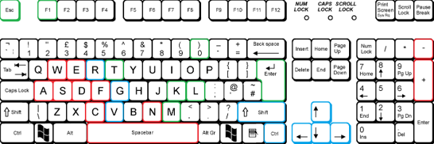
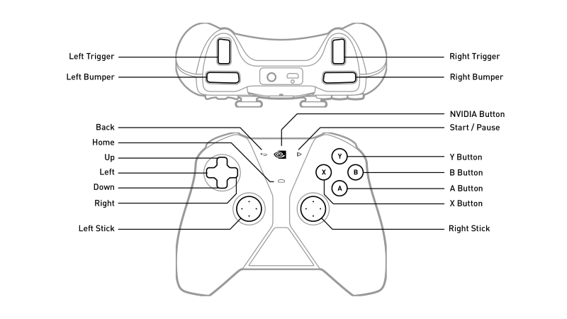
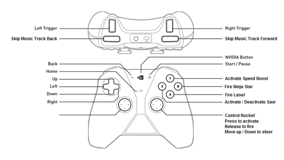

# Game Controls

## Keyboard Controls

    Keyboard control layout

!!! info

    The game uses the keyboard as the primary input device, divided into general game keys, Player 1 controls, and Player 2 controls (see image above).

### Keyboard Controls

| Player 1 | Player 2 | Description |
| -------- | -------- | ----------- |
| **A** | **←** | Move left |
| **S** | **↓** | Move down |
| **D** | **→** | Move right |
| **W** | **↑** | Move up |
| **E** | **R** | Activate/Deactivate Saw (shield deactivates when Saw is active, and vice versa) |
| **F** | **G** | Activate Speed Boost (lasts 3.0 seconds; remaining time is indicated by the status bar on the HUD) |
| **C** | **V** | Hold to activate the rocket and power bar; release to fire. (***see note**) |
| **-** | **-** | Move the rocket up the screen (decreases Y-axis value) |
| **+** | **+** | Move the rocket down the screen (increases Y-axis value) |
| **Spacebar** | **CTRL** | Fire laser weapon |
| **N** | **SHIFT** | Fire ninja star weapon |

!!! note

    If C / V key not released before the rocker status bar finishes, the rocket will explode.

### Other Game Keys

* **Esc**: Pause / Main Menu / Back to menu from sub-menu
* **F1**: Show Frames Per Second (FPS)
* **T**: Show/Hide the Game Map
* **0**: Stop the music
* **K**: Skip music track backwards
* **L**: Skip music track forwards
* **M**: Pause the music track
* **ENTER**: Enter text from the Enter Name screen

## Gamepad Controls

!!! info

    The game supports game controllers (such as the NVIDIA Shield Controller layout shown in images above). Directional pads handle ship movement, and controller buttons map to core actions like firing weapons and activating specials.