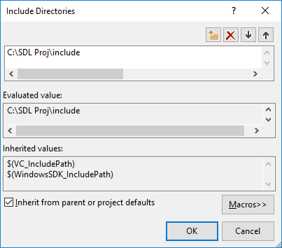

# Setup

## Game Installation

Installing the game requires **Visual Studio Community 2015**, which is available free from Microsoft. The project also requires the following SDL extension libraries:

* **SDL_2_Image** (for loading images other than bitmaps)
* **SDL_2_Mixer** (for audio support)
* **SDL_2_TTF** (for True Type Fonts)

### Configuring Library Directories

    SDL Includes in Visual Studio 2015

1. Open the project in Visual Studio 2015.
2. Select **Project > Properties > VC++ Directories**.
3. Set the path to the **Include Directories** and **Library Directories** (as shown in image above). 

!!! note "Subsystem"

    This version of the project does not use any SubSystem under the *Linker > System* tab.

### Project Path Setup

The project code is configured to use the path `C:/SDL Proj/`, which was the universal setup configuration used by all group members during development. The `SDL Proj` folder is included in the project files under `SDL Includes and Library – Contents of this folder needs to be on c drive`. Copy this folder directly to the `C` drive on your computer running Visual Studio 2015 to launch the project. WinRar was used to compress project folders as `.rar` files.

!!! warning "Mandatory Directory Structure"
    The project code is hardcoded to look for the SDL libraries and files under `C:/SDL Proj/`. Make certain you copy the provided SDL folder directly to the root of your C drive.
    
!!! note "Visual Studio Version"
    This project was built using Visual Studio Community 2015. Opening the solution in newer versions of Visual Studio may prompt you to upgrade the Windows SDK target version.