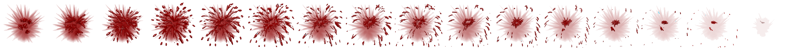

# Blood Cells

## Overview (`BloodCell.h`, `BloodCell.cpp`)

```text
┌---------------------------┐
|        BloodCell          |
├---------------------------┤
| -mMovement: int           | 
├----------------------------
| +Move() : virtual void    | - Up & down movement, random speed set in spawnBloodCell
| +moveStalker() : virtual  | - Move White Blood Cells to small Enemy Virus to tidy up
| +render() : virutal void  | - Render from Texture map using ID, rotation set in move
| +destroy() : virtual void | - Destroy the blockage when off screen
| +getMovement() : int      | - Get the value of the mMovement variable
| +setMovement() : void     | - Set the value of the mMovement variable
└---------------------------┘
```

Blood cells inherit from the `Enemy` base class and represent biological components floating inside the bloodstream. The constructor accepts a subtype integer that defines the cell type, dimensions, texture ID, and rotation attributes.

* **Small Blood Cells**: Drift passively in the background to provide atmosphere and depth without colliding with the player.
* **Large Blood Cells**: Act as physical obstacles that push the player backwards. When hit by cutting weapons, they split apart and trigger blood explosion animations.
* **White Blood Cells**: Act as neutral helpers. If an Enemy Virus is split in half by the player, white blood cells home in on the smaller virus particles to clean them up.

## Key Functions

* `move()`: Updates vertical oscillation and applies clockwise or anti-clockwise rotation based on random speed attributes.
* `moveStalker()`: Moves White Blood Cells directly towards the nearest small virus coordinates.
* `render()`: Renders the texture from the texture map using its rotation angle and pivot point.
* `destroy()`: Deactivates the blood cell once off-screen.

## Sprite Sheet


    Blood Cell sprite


    Blood Cell Small sprite



    Blood Cell Explosion
