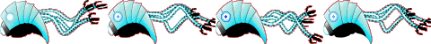

# Enemy Ship / Nano-bots

## Overview (`EnemyShip.h`, `EnemyShip.cpp`)

```text
┌---------------------------┐
|         EnemyShip         |
├---------------------------┤
| +move() : virtual void    | - Move the Nano-bot and set the animation frame
| +destroy() : virtual void | - Destroy using Game Object destroy function
| +render() : virtual void  | - Use the Game Objects animation rendering
└---------------------------┘
```

`EnemyShip` represents robotic nano-bots patrolling the bloodstream.

* **Movement**: Moves linearly along the horizontal axis from right to left.
* **Attacking**: Periodically fires enemy laser beams based on its X-coordinate and preset distance intervals.
* **Rendering**: Animated using a multi-frame sprite sheet rendered via the inherited `renderAnimation()` function.

## Sprite Sheets


    Enemy Ship Sprite Sheet



    Enemy Ship Animation Sprite Sheet