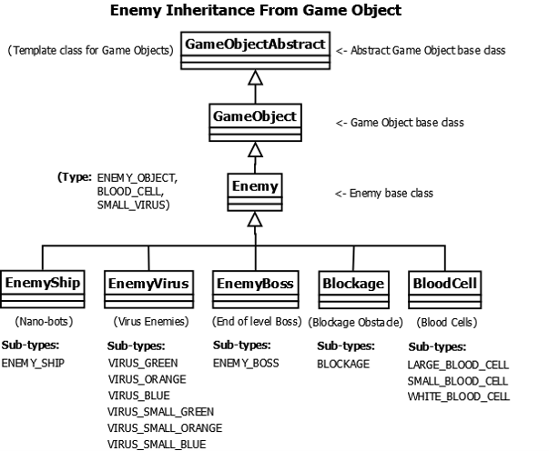

# Enemy Base

## Overview (`Enemy.h`)

    Enemy Inheritance

`Enemy` is an intermediate base class that inherits from [GameObject](../game-object.md). It acts as a common interface and categorization tag for all hostile and neutral entities moving from right to left across the screen.

* **Subclasses**: [EnemyShip](enemy-ship.md), [EnemyVirus](enemy-virus.md), [EnemyBoss](enemy-boss.md), [Blockage](blockage.md), and [BloodCell](blood-cells.md).
* **Purpose**: Allows the main game loop to batch-process movement, collision verification, and memory deallocation across diverse enemy subtypes instead of using separate lists for each entity.

---

    Enemy Ship

    Blockage

    Enemy Boss

    Bloodcell

