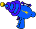
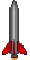

# Power Ups

## Overview (`PowerUp.h`)

```
┌------------┐
|   PowerUp  |
├------------┤
| +move()    | - Move the power ups right to left
| +destroy() | - Inherit destroy from GameObject
| +render()  | - Render texture to screen
└------------┘
```

The `PowerUp` class manages collectible bonus items spawned randomly during levels.

* **Subtypes**:
* `HEALTH_BOX`: Restores player health.
* `POWERUP_LASER`: Upgrades standard single lasers to double or triple spread lasers.
* `POWERUP_ROCKET`: Adds guided rockets to the player's inventory.
* `POWERUP_LIFE`: Awards an extra ship life.
* `POWERUP_CLOCK`: Adds extra seconds to the stage countdown timer.

* **Movement**: Drifts right to left across the screen at randomized speeds.

## Sprites


    Health Box



    Laser


    Life



    Rocket
