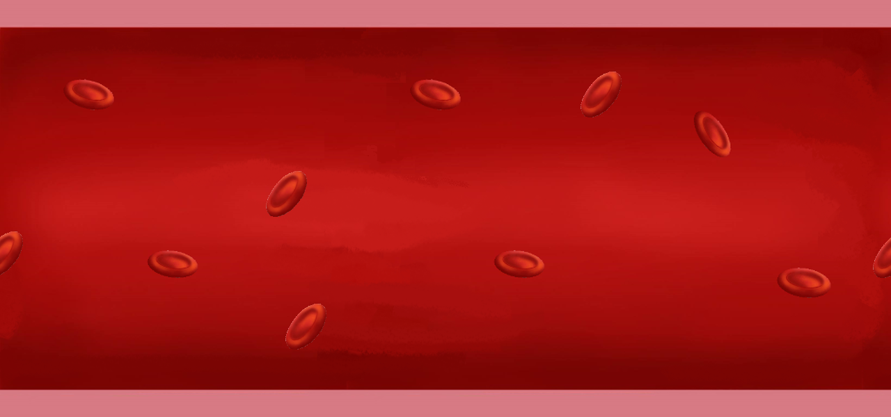
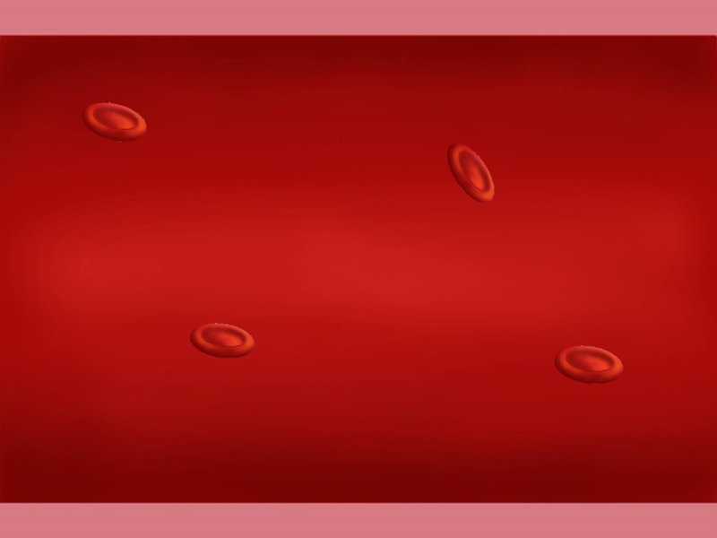
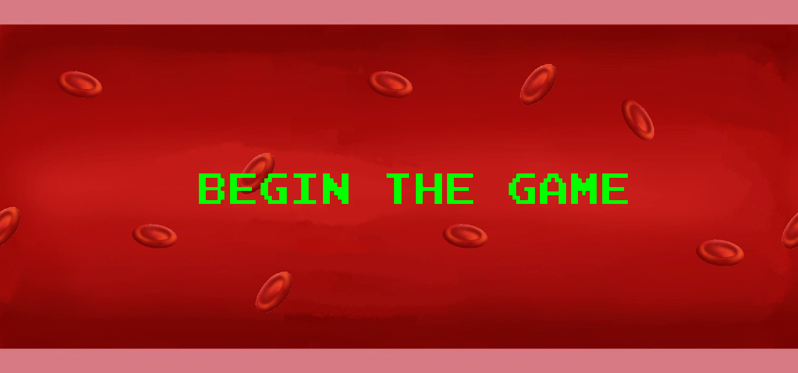
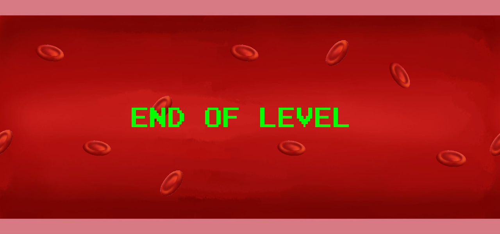

# Scrolling Background

## Overview (`ScrollingBackground.h`)

```text
┌---------------------┐
| ScrollingBackground |
├---------------------┤
| +scrollingOffset    | - Offset the background, reset when backgrounds move off screen
| +move()             | - Move the background per scroll speed
| +destroy()          | - Only one instance of background is used
| +render()           | - Render texture to screen
| +loadBackground()   | - Load media for Backgrounds
└---------------------┘
```

The `ScrollingBackground` class handles seamless background rendering and scrolling as an active `GameObject`.

* **Looping Technique**: Renders two identical background textures side by side. As the first image scrolls off the left edge, its offset resets to the right edge of the second image, creating an endless loop.
* **Level Progression**: Tracks loop counts via `scrollingOffset` to stop scrolling when reaching boss arenas or scripted checkpoint events.

## Sprites



    Background 720 Pixels High



    Background 800 Pixels High



    Background 800 Pixels High



    Background 800 Pixels High

## Screenshots


    Background format