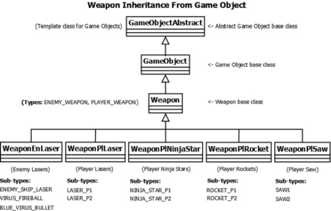

# Weapon Base

## Overview (`Weapon.h`)

```text
┌-------------------------------┐
|             Weapon            |
├-------------------------------┤
| -m_Angle: int                 | - Angle of rotation
| -m_Grade: int                 | - Grade of the weapon
├-------------------------------┤
| +getGrade () : int            | - Get laser grade
| +setGrade () : void           | - Set laser grade
| +handleEvent() : virtual void | - Handle events for rocket
└-------------------------------┘
```



    Weapon Inheritance Tree

`Weapon` is the base class for all player and enemy projectiles, inheriting from `GameObject`.

* **Attributes**: Tracks weapon grade (single, double, triple beam), trajectory angles, velocity vectors, and projectile ownership (Player 1 vs Player 2).
* **Input Handling**: Defines virtual input hooks used by controllable sub-weapons such as guided rockets.

---


    Player Laser


    Enemy Laser


    Blue Ninja Star


    Yellow Ninja Star


    Rocket


    Saw