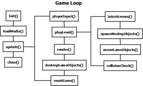

# Game

## Overview (`Game.h`, `Game.cpp`)

```text
┌-------------------------┐
|          Game           |
├-------------------------┤
| -gRender: SDL_Renderer* | - SDL_Renderer renders textures to screen, this is global
| -mNumPlayers: int       | - The number of players in the game
| -mCurrentLevel: int     | - Current game level, default value is MENU, where game begins
| -s_pInstance: Game      | - Game singleton, one instance of Game used throughout project
| +settingsMenuLoaded     | - Decides if game has loaded the Settings Menu state media
| +highScoresLoaded       | - Decides if game has loaded the High Scores Table state media
| +enterNameLoaded        | - Decides if game has loaded the Enter Name state media
| +displayGameIntro       | - Display the titles and credits at start of game
| +displayLevelIntro      | - Display the level intro information and objectives
| +gWindow                | - The window the game is rendered to
| +windowFlag: int        | - Flag decides the mode for the window FullScreen/Windowed
| +gameViewport           | - Viewport, or section of the window, the game is rendered to
| +player1Score: int      | - Score for Player 1, to be displayed & written to high scores
| +player2Score: int      | - The score for Player 2
| +nameEntered: bool      | - Has a name been entered for the Player
| +renderText: bool       | - Render the game text to the screen
| +inputText              | - Text to be input for the players name
| +checkpointsSpawned     | - Number of checkpoints spawned
| +twoPlayer: bool        | - Decides if the game is 2 player or 1 player
| +frames: int            | - Frame count for speed of Enemy animation
| +lastTime               | - Last time used for rendering the game timer in seconds
| +currentTime            | - The current game time
| +countdownTimer         | - The countdown timer, the game time as it counts down
| +gameOverTimer          | - Time before moving from the Game Over screen back to menu
| +backgroundLoopCounter  | - Number of times the background image has looped
| +levelToPause: int      | - Store current level to return to from the Pause menu
| +gameover: bool         | - Decide if Game is over
| +levelOver: bool        | - Decide if Level is over
| +noTime: bool           | - Decide if time has run out for the level
| +infoMessageP1Counter   | - Time to display notification messages for Player 1
| +infoMessageP2Counter   | - Time to display notification messages for Player 2
| +infoMessageCounter     | - Centre message, not specific to players
| +infoMessageMapCounter  | - Additional Game messages
| +infoMessageP1          | - Player 1 notification messages. Different colour each player
| +infoMessageP2          | - Player 2 notification messages
| +infoMessageGeneral     | - Additional game messages
| +infoMessageMap         | - Additional game messages
| +gameOverMessageCounter | - Length of time to display game over message
| +finalScores            | - Game Over Message for scores
| +gameWinners            | - Game Over Message for game winner
├-------------------------┤
| +Instance() : Game      | - Return single Game Instance, to access functions & variables
| +Init() : bool          | - Initialise the game
| +loadMedia() : bool     | - Load the game media, textures, audio, etc.
| +update() : void        | - Update the game
| +playerInput() : bool   | - Handle Player input
| +moveGameObjects()      | - Move the Game Objects on screen
| +render() : void        | - Render the game objects to screen
| +destroyGameObjects()   | - Destroy the game objects
| +close() : void         | - Close the game and clear objects from memory
| +resetGame() : void     | - Reset the level or the game
| +fullScreenOrWindowed() | - Set the game view as Full Screen or Windowed
| +getRenderer()          | - Return the render for the game window
| +getCurrentLevel()      | - Get the current game level
| +setCurrentLevel()      | - Set the current game level
| +displayLevelIntros()   | - Display the intro screens for the current level
| +enterName() : bool     | - Enter name for Player to be used in High Scores Table
| +playLevel() : void     | - The loop for each level
| +displayScoreForObject()| - Spawn a score to the player receives for destroying Enemy
| +displayText() : void   | - Display the game text, by rendering text to a texture
| +infoMessage() : void   | - Display an information message on screen
| +checkMessageTimes()    | - Check how long a message has been on screen
| +renderGamePlay()       | - Render the Game Objects to the screen
| +renderGameOver()       | - Render the Game Objects for the Game Over state
| +renderTimer() : void   | - The game timer update and rendering
| +spawnMovingObjects()   | - Decide the amount of each Game Object to spawn
| +spawnRandomAttributes()| - Spawn random attributes for Game Objects
| +spawnPlayer() : void   | - Spawn / Respawn player at start of level / after life
| +spawnEnemyBoss()       | - Spawn an Enemy Boss
| +spawnEnemyShip()       | - Spawn Nano-bot (Enemy Ship) at random Y coordinates
| +spawnEnemyVirus()      | - Spawn Virus at random Y coord, or small virus at x, y coords
| +spawnBloodCell()       | - Spawn Blood Cells at random time, position, rotation
| +spawnLaser() : void    | - Spawn Laser at Player coords, based on Weapon grade
| +spawnEnemyLaser()      | - Spawn Enemy Laser, Fireball, or Satellite Projectile
| +spawnNinjaStar()       | - Spawn Ninja Star, from the Players coordinates
| +spawnSaw() : void      | - Spawn a Saw at Player coordinates, or deactivate if active
| +spawnPowerUp()         | - Spawn a Power Up randomly selected, with random position
| +spawnRocket() : void   | - Spawn a Rocket from the players coordinates
| +spawnBlockage()        | - Spawn a Blockage obstacle in Level 2 and Level 3
| +spawnExplosion()       | - Spawn an Explosion at coordinates of the collision impact
| +moveToPlayer1()        | - Move Enemy Virus to nearest Player, using Euclidean distance
| +gameProgress()         | - Decide if the game is over or not
| +checkCollision()       | - Check for a collision between 2 game objects
| +collisionCheck()       | - Cycle Game Object list, check collisions, decide what to do
| +getNumPlayers()        | - Set number of Players in the game
| +setNumPlayers()        | - Set number of Players in the game
| +managePlayerHealth()   | - Set health of Player after collision, increase if Power Up
| +managePlayerScores()   | - Set Player score after destroying Enemy objects
└-------------------------┘
```

The `Game` class is the central Singleton engine driving the entire project. It manages window initialisation, subsystem setup, media loading, the core game loop, entity spawning, collision testing, and state transitions.

## Core Systems

* `init()`: Initialises SDL subsystems (Video, Audio, Joystick, Haptic), sets up `gWindow` and `gRenderer`, configures TTF fonts, and initialises gamepads.
* `update()`: Houses the main game loop, polling input events, checking state flags, updating moving objects, resolving collisions, and cleaning dead entities.
* `spawnMovingObjects()`: Spawns enemies, power-ups, obstacles, and blood cells based on active level rules and randomized attribute pools.
* `destroyGameObjects()`: Iterates through the game object list and deallocates entities marked as dead (`m_Alive == false`).
* `resetGame()`: Clears active entities, resets timers, and reinitialises player states when restarting or advancing levels.

## Game Loop



    Game Loop Diagram
