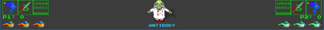

# Heads Up Display (HUD)

## Overview (`HUD.h`, `HUD.cpp`)

````text
┌------------------------┐
|           HUD          |
├------------------------┤
| +UIVP                  | - Menu below main game screen view port
| +mapVP                 | - Map indicates Ship current location in professors body
| +weaponVP1             | - Indicates the currently selected main weapon
| +weaponVP2             | - Indicates the currently selected main weapon
| +rocketVP1             | - Indicates the current amount of Rockets for Player 1
| +rocketVP2             | - Indicates the current amount of Rockets for Player 2
| +boostVP1              | - Indicates if Player 1 speed boost is active
| +boostVP2              | - Indicates if Player 2 speed boost is active
| +scoreP1               | - Score for Player 1
| +scoreP2               | - Score for Player 2
| +aliveP1               | - Player 1 is alive or not
| +aliveP2               | - Player 2 is alive or not
| +livesP1               | - Player 1 lives
| +livesP2               | - Player 2 lives
| +gradeP1               | - Current Laser grade (single, double, or triple beam)
| +gradeP2               | - Player 2 laser weapon grade
| +rocketsP1             | - Player 1 amount of rockets in inventory
| +rocketsP2             | - Player 2 amount of rockets in inventory
| +speedP1               | - Is Player 1 speed boost active
| +speedP2               | - Is Player 2 speed boost active
| +TimerP1               | - Player 1 speed boost timer
| +TimerP2               | - Player 2 speed boost timer
| +weaponScrolling       | - Scrolling for animations when level loads
| +gHUDFont              | - Font used for rendering Heads Up Display text to texture
| +gLevelTextTexture     | - The level number text texture
| +gSpeedBoostTexture    | - Speed Boost text texture
| +gPowerUpRocket        | - Rocket Power Up texture
| +gNumRocketsText1      | - Player 1 number of rockets text texture
| +gNumRocketsText2      | - Player 2 number of rockets text texture
| +gCreatedByText1       | - Animated created by text frame 1 - ANTIBODY
| +gCreatedByText2       | - A GAME BY text texture
| +gCreatedByText3       | - JOE O'REGAN, SEAN HORGAN, BRIAN RYAN text texture
| +gP1LivesTexture       | - Player 1 Small ship for number of lives
| +gP2LivesTexture       | - Player 2 Small ship for number of lives
| +gP1ScoreText1         | - Player 1 current score
| +gP2ScoreText2         | - Player 2 current score
├------------------------┤
| +getPlayerInfo()       | - Import information from Game class
| +MiniMap()             | - Decide between full and mini map
| +render()              | - Combine all HUD rendering to one function
| +shipPositionOnMap()   | - Positions on mini map
| +loadHUDMedia()        | - HUD media, Set viewports, render text textures
| +resetHUD()            | - Reset HUD (map viewport, and scrolling)
| +closeLevelStuff()     | - Free HUD media from memory
| +rendPlayerLives()     | - Display number of lives for each player
| +renderParticles()     | - Display animated Game Creators text
| +spawnPlayersSaw()     | - Display number of rockets in each players inventory
| +speedBoostIndicator() | - Indicate Players speed boost is active and show timer
| +playerScore()         | - Display Each players score
| +displayLevelNum()     | - The current level number
| +percentageNinjaStrs() | - NOT USED - Track kill rate for Ninja Star Weapons
| +playerScoresCounter() | - NOT USED - Function was to indicate enemy numbers, etc.
└------------------------┘
```

The HUD class manages the player dashboard fixed at the bottom of the screen.

## Dashboard Elements

* **Player Statistics**: Displays current scores, remaining lives (rendered as mini ship icons), and current level indicators.
* **Weapon Indicators**: Shows active laser grade, remaining rocket ammo, and active speed boost countdown bars.
* **Mini-Map**: Renders a miniature cross-section of the Professor's body showing the journey's start and end checkpoints, toggleable between mini and full-screen viewports with **T**.
* **Optimisation**: Uses cache checks (`displayLevelNum()`, `playerScore()`, `rocketIndicator()`) to make certain static text is only re-rendered to textures when values change, preventing severe memory leaks.

## Images



    Heads Up Display (HUD)