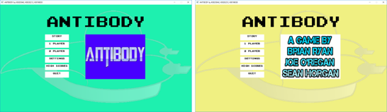

# Main Menu

## Overview (`Menu.h`, `Menu.cpp`)

```text
┌---------------------┐
|        Menu         |
├---------------------┤
| +gFont              | - Font used when rendering text
| +gMenuTextTexture1  | - Antibody (Menu title text)
| +gMenuTextTexture2  | - Story Mode button text
| +gMenuTextTexture3  | - Single Player button text
| +gMenuTextTexture4  | - Two Player button text
| +gMenuTextTexture5  | - Settings button text
| +gMenuTextTexture6  | - High Scores button text
| +gMenuTextTexture7  | - Quit button text
| +gMenuTextTexture8  | - Pause button text
| +gMenuTextTexture9  | - Resume button text
| +gMenuTextTexture10 | - Return to Main Menu from Pause button text
| +gMenuButtons       | - Array of Menu buttons
| +gSpriteClipsMenu   | - Button animation frames
| +gButtonSpriteSheet | - Button animation sprite sheet
├---------------------┤
| +closeMenuMedia()   | - Free the Menu media
| +handleMenuEvents() | - Handle events for menu buttons
| +loadMenuMedia()    | - Load the Menu media
| +draw()             | - Render Main Menu textures to screen
| +drawPause()        | - Render Pause Menu textures to screen
| +randomBGColour()   | - Select a random menu background colour
└---------------------┘
```

The `Menu` class handles top-level UI navigation, game mode selection, and the pause menu.

* **Modes**: Provides entry buttons for Story Mode, Single Player, Two Player, Settings, High Scores, and Quit.
* **Visuals**: Picks a random background colour upon entry and renders animated title credits.
* **Pause Overlay**: Contains `drawPause()` routines to display resume and quit options when the game is paused via **Esc**.

## Images



    Main Menu
