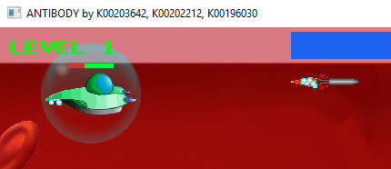

# Particles

## Overview (`Particle.h`, `Particle.cpp`)

```text
┌---------------------┐
|       Particle      |
├---------------------┤
| +gShimmer           | - Type of particle - Shimmer
| +one                | - Type of particle
| +two                | - Type of particle
| +three              | - Type of particle
| +four               | - Type of particle
| +five               | - Type of particle
| +six                | - Type of particle
| -mPosX              | - Offset X position
| -mPosY              | - Offset Y position
| -mFrame             | - Current animation frame
| -mTexture           | - Particle texture
├---------------------┤
| +render()           | - Render the particle textures to screen
| +isDead()           | - Checks if particle is dead
| +initPlayerEngine() | - Set up particles for Players ship engine
| +initRocketTrail()  | - Set up particles for Players rocket weapon
| +initParticle()     | - Load media for Particles
| +closeParticle()    | - Free media for Particles from memory
└---------------------┘
```

The `Particle` class drives the dynamic particle generation system for player engine trails and launched rockets.

* **Mechanics**: Spawns randomized shimmer textures behind moving ships and rocket thrusters.
* **Lifespan**: Each particle has an independent frame life (`mFrame`), fading and deallocating over time to create a continuous exhaust effect.

## Sprites


## Screenshots



    Player Ship & Rocket Particles