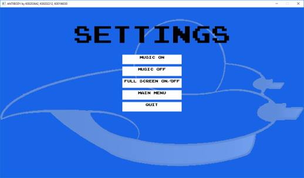

# Settings Menu

## Overview (`SettingsMenu.h`, `Settings.cpp`)

```text
┌-----------------------┐
|     SettingsMenu      |
├-----------------------┤
| +gFont                | - Font used to render text
| +gMenuText1           | - Settings Menu title text
| +gMenuText2           | - Music On button text
| +gMenuText3           | - Music Off button text
| +gMenuText4           | - Full Screen On / Off button text
| +gMenuText5           | - Main Menu button text
| +gMenuText6           | - Quit button text
| +gSettingsButtons     | - Array of buttons
| +gSpriteClipsSettings | - Animation frames
| +gButtonSpriteSheet2  | - Sprite sheet for buttons
├-----------------------┤
| +loadSettingsMedia()  | - Load media for Settings Menu
| +closeSettingsMedia() | - Close media for Settings Menu
| +handleSettingsEv()   | - Handle button events
| +draw()               | - Render textures to screen
└-----------------------┘
```

Manages configuration options via an interactive button interface.

* **Audio Toggle**: Enables or disables background music playback (`Music On / Off`).
* **Display Mode**: Switches between Windowed and Fullscreen display modes using `SDL_SetWindowFullscreen()`.
* **Navigation**: Provides return links back to the Main Menu.

## Screenshots



    Settings Menu