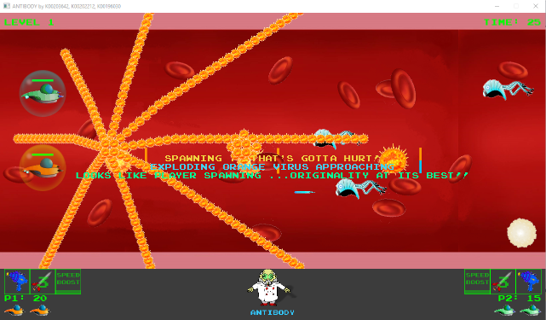
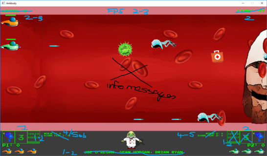
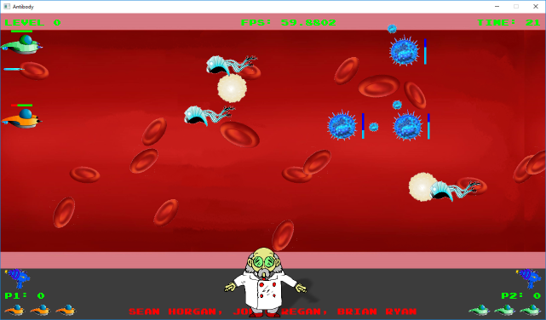
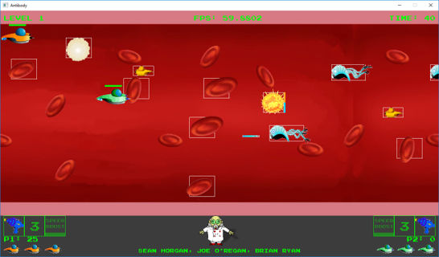

# Testing & Implementation

## Testing Strategy

Features that proved challenging were isolated and tested independently using minimal code testbeds before integration into the main project. Unifying the setup paths across all team members' machines (`C:/SDL Proj/`) allowed projects to be zipped and shared instantly via Google Drive to ensure parity.

## Key Development Hurdles & Bug Fixes

### Orange Virus Spawning

    Orange Virus Spawning

Fixed. Moving the exploding Orange Virus projectile spawning logic directly into the Game render function caused excessive object replication until 

---

### Text Rendering Memory Leak

    Text Rendering Memory Leak

A severe memory leak of up to 40 MB per second was traced to rendering unchanging text strings to textures every frame. This was resolved by implementing conditional update checks so text is only re-rendered when values change.

!!! danger "Text Rendering Memory Leak"
    Rendering unchanging text directly to textures every single frame caused a massive memory leak of up to 40 MB/s. Always make certain that conditional checks are used so text objects only re-render when their underlying values actually change.

---

### Blue Virus Projectile Behavior

The initial plan for the Blue Virus to expire upon timer completion was refactored into a looping reload mechanic where new satellite projectiles orbit until firing.

    Blue Virus Projectile Behavior

---

### Collision Volume Storage

    Collision Volume Storage

Standard `std::list` structures caused errors when storing game objects accompanied by `SDL_Rect` colliders. Replacing lists with `std::vector` containers completely resolved the issue.

---

!!! info "Team Sync Strategy"
    Unifying the library paths and include directories across all developer machines early in the project lifecycle made it easy to zip and share stable builds via Google Drive without broken references.